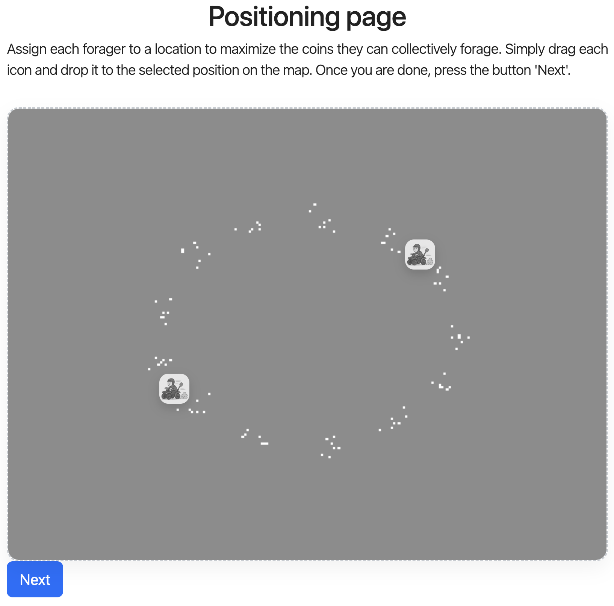
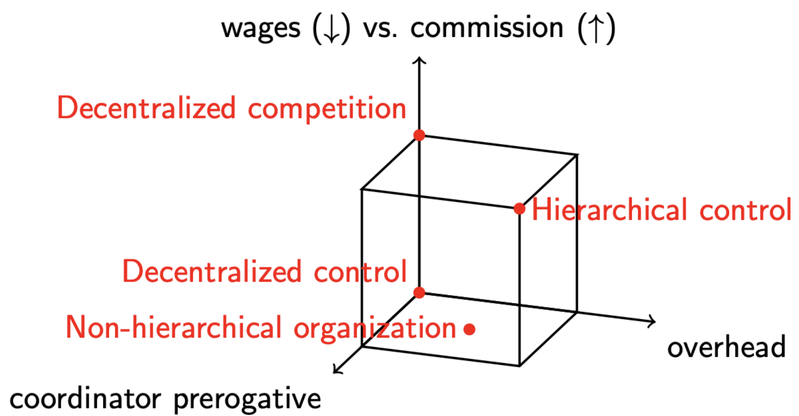
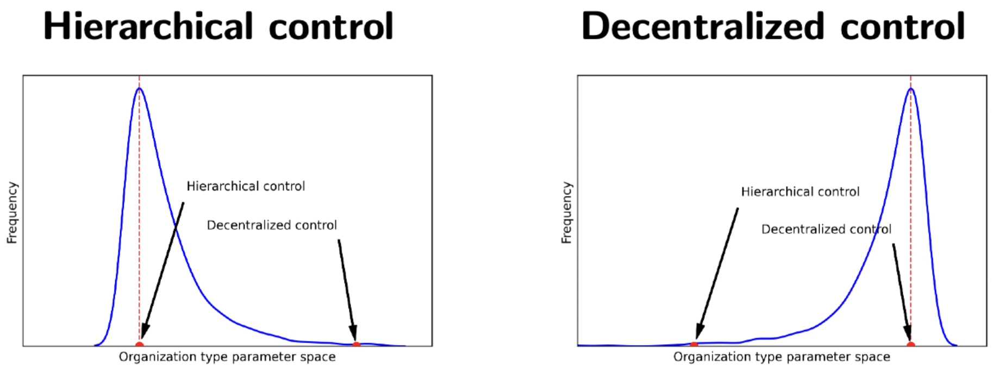

# Research interests

My research sits at the intersection of cognitive science and artificial intelligence, with a focus on the cognitive basis of collective behavior. I study how humans learn to coordinate and specialize into roles, giving rise to structured groups. To do so, I combine behavioral experiments (both controlled lab studies and large-scale deployments) with computational cognitive models that illuminate strategic coordination and group decision-making. 

My research projects can be summarized in the following topics:

- Cognitive Science and Group cognition
- Artificial Intelligence
- Formal Semantics and Philosophy of Language
- Logic and Semantics

### Cognitive Science and Group cognition

**Power in hierarchical roles**

In this project, we study the dynamics of small groups organized into hierarchical roles. Our goal is to understand how different distributions of power shape the group’s social contract, and how these choices affect outcomes such as efficiency, fairness, and well-being. By identifying general relationships between role structure, power, and performance, we aim to contribute to research on online governance and collective intelligence.

To make these questions concrete, we are running a large-scale online experiment in which foragers collect resources from the environment. Group performance depends in part on a coordinator, who invests in information about resource locations and assigns foragers to initial positions.

We represent the social contract along three dimensions that jointly determine how resources are distributed and how much autonomy foragers retain. This framework lets us locate and compare characteristic organizational arrangements within a single space.

Using an iterated-learning design, we will examine which arrangements tend to persist and converge when different roles are given the authority to modify the social contract.

This approach allows us to ask: if decision power rests with the coordinator (the higher-ranking role), do groups gravitate toward tighter hierarchical control? If a forager holds that power, do groups move toward more egalitarian structures? And what organizational form emerges when the system is optimized for well-being?

**Papers in the topic of group cognition**

- The emergence of role specialization
- Self-organization of division of cognitive labor
- The division of linguistic labor as an off-loading cognitive strategy
- bibtex file

### Semantic Parsing

- Leveraging...

### Formal Semantics and Philosophy of Language

- A misconception of logic
- Models of language
- DRT and ...

### Logic and Semantics

- df
- fdf
- df
- df

[Back to my profile](/profile/)
