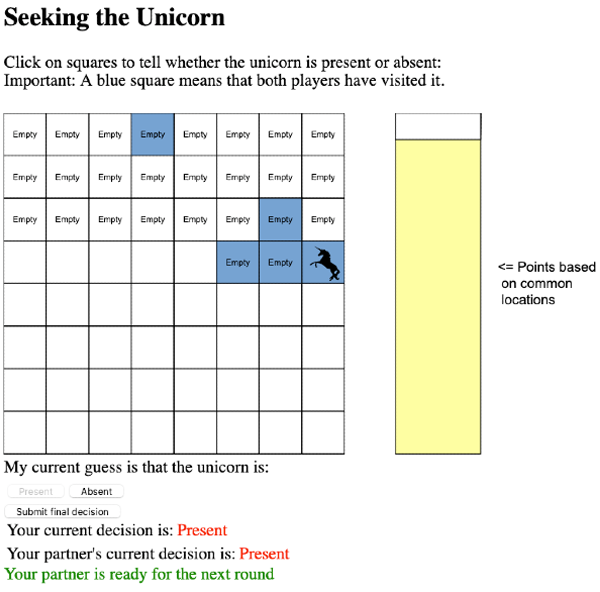
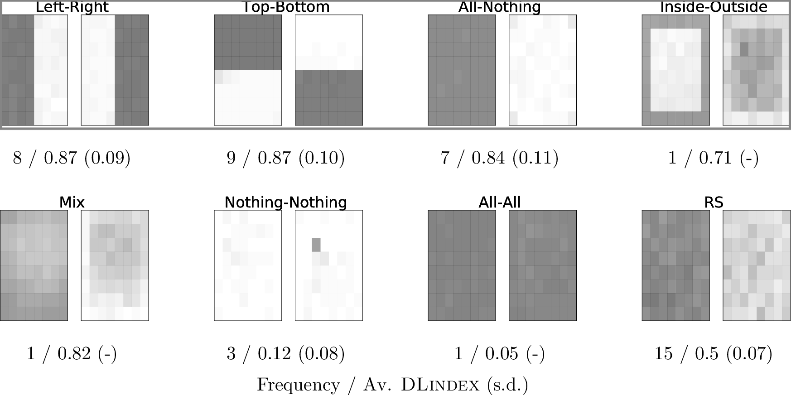
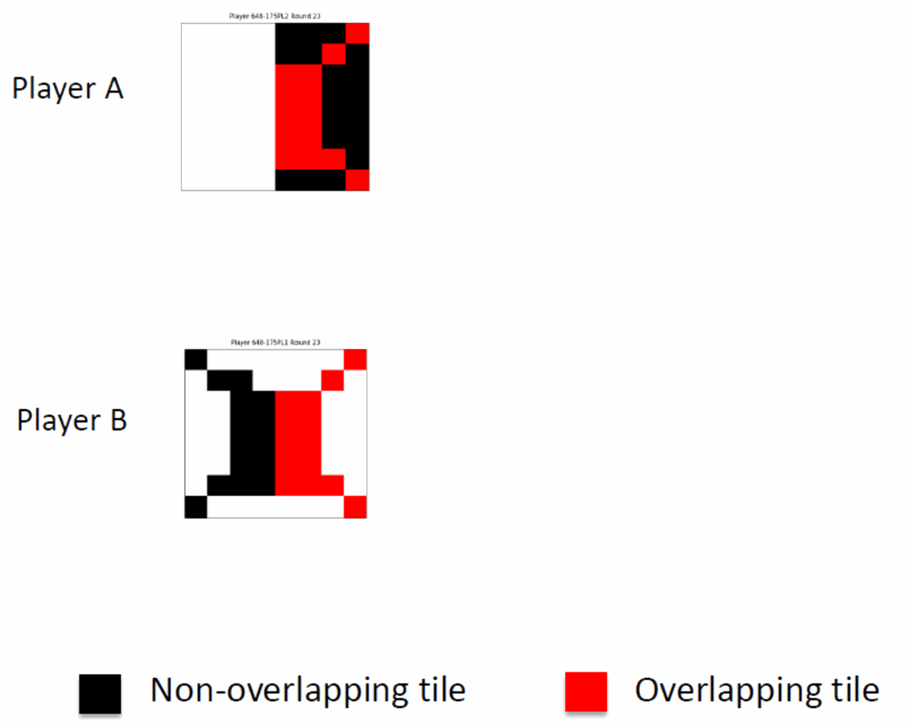
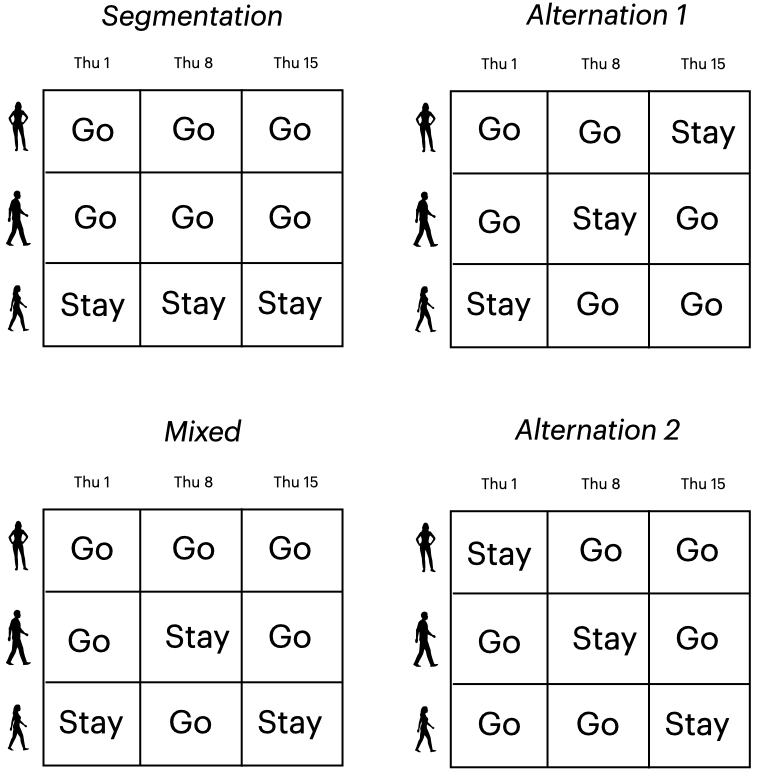
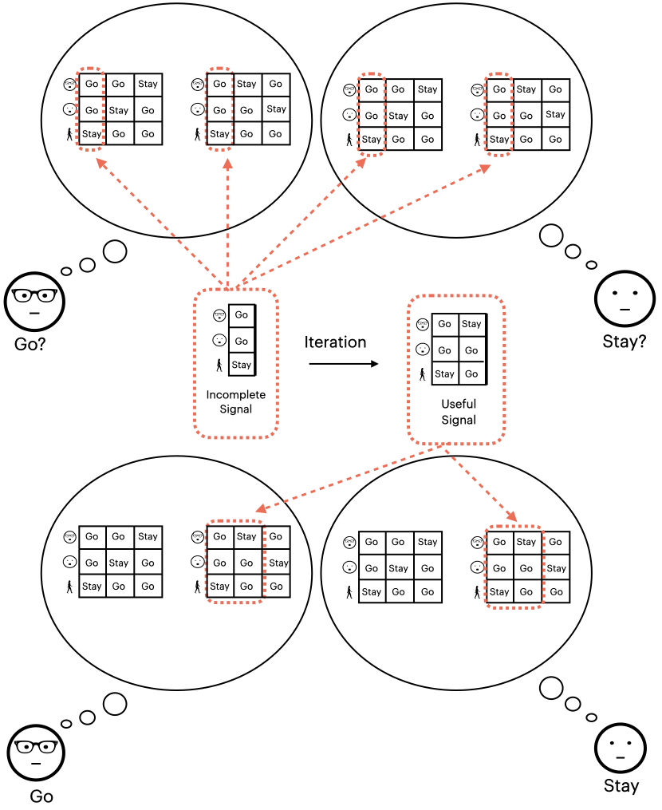

# Research interests

My research projects can be summarized in the following topics:

- [Group cognition and cooperation](#group-cognition-and-cooperation)
- [Logic and Semantics](#logic-and-semantics)

### Group cognition and cooperation

We investigate how cognitive, structural, and environmental factors drive coordination, efficiency, and fairness. 

**Cooperation and focal points**

One of our core findings demonstrates that 'focal points'—psychologically salient solution scenarios—are instrumental in achieving coordination during iterated tasks.

The central idea is this: When faced with a coordination problem, humans mentally simulate a few potential scenarios. They then assess how well their current reality matches these imagined scenarios and adjust their behavior to align with the most accurate prediction (see [this paper](https://onlinelibrary.wiley.com/doi/full/10.1111/tops.12644) for a more overarching approach).

To illustrate the point, consider [the following task](https://journals.plos.org/plosone/article?id=10.1371/journal.pone.0254532): A pair of players must find whether there is or not a unicorn hidden beneath one of the tiles in a grid.

Each player privately knows what they find under the tiles. The public knowledge is which tiles both players have searched in common and what the other player has guessed. Overlapping searches penalize the players' score.

Examining the frequency each tile was uncovered, we found that players split the grid using some natural divisions.

These regions drove players' decisions in an interesting way: they worked as behavioral attractors and the complementary regions acted as repellers. A player was more likely to uncover a region the more it resembled a focal region. And the more their inefficient overlap resembled a focal region, the more the player was attracted to the complementary region. Here is an illustration of this mechanism:

We fit a computational cognitive model incorporating these mechanisms to the data. The model outperformed several alternative accounts and qualitatively reproduced the behavioral patterns observed in the experiment. See details in [this paper](https://journals.plos.org/plosone/article?id=10.1371/journal.pone.0254532).

We observed a similar use of focal regions in a different coordination task: the El Farol Bar Problem. In this paradigm, a town of 100 people has a bar that everyone would like to visit every Thursday. If no more than 60 people attend, everyone enjoys the evening. If attendance exceeds 60, the bar becomes overcrowded, and those who went would have preferred to stay home.

The El Farol Bar Problem captures the tension between individual and collective interests. Each person prefers to attend the bar, but when too many do so, everyone's payoff declines. Moreover, avoiding overcrowding does not guarantee fairness. Attendance patterns such as the segmented and mixed solutions shown in the left column of the figure below achieve efficient use of the bar while producing unequal payoffs across individuals. By contrast, the two alternation patterns in the right column achieve the same level of efficiency while distributing attendance opportunities equally over time.

We found that people maintain a small repertoire of intuitive behavioral patterns, then track which focal pattern best reflects the group's recent history and coordinate their actions based on the predictions of this best-fitting schema. An illustration of this mechanism is illustrated in the following Figure:

Our proposed computational cognitive model builds directly upon this pattern-prediction intuition. It also includes two lower-level mechanisms, which reward payoff and attendance. This model fits the experimental data better than other models based on reinforcement learning, bounded rationality, an fictitious play.

**Cultural evolution of power**

In this project, we study the dynamics of small groups organized into hierarchical roles. Our goal is to understand how different distributions of power shape the group’s social contract, and how these choices affect outcomes such as efficiency, fairness, and well-being. By identifying general relationships between role structure, power, and performance, we aim to contribute to research on online governance and collective intelligence.

To make these questions concrete, we are running a large-scale online experiment in which foragers collect resources from the environment. Group performance depends in part on a coordinator, who invests in information about resource locations and assigns foragers to initial positions.

We represent the social contract along three dimensions that jointly determine how resources are distributed and how much autonomy foragers retain. This framework lets us locate and compare characteristic organizational arrangements within a single space.

Using an iterated-learning design, we will examine which arrangements tend to persist and converge when different roles are given the authority to modify the social contract.

This approach allows us to ask: if decision power rests with the coordinator (the higher-ranking role), do groups gravitate toward tighter hierarchical control? If a forager holds that power, do groups move toward more egalitarian structures? And what organizational form emerges when the system is optimized for well-being?

**Institutional context of fairness behaviors**

**Division of linguistic labor**

### Logic and Semantics

- A misconception of logic
- Models of language
- DRT and ...
- Leveraging...

[Back to my profile](/profile/)
